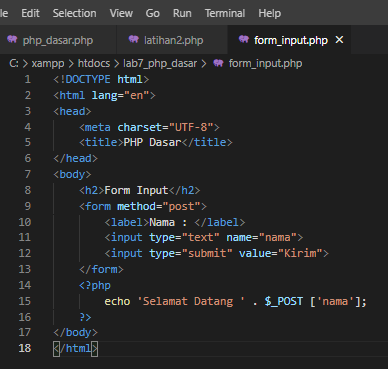

# Lab7Web
## Membuat PHP Dasar
Buat File baru dengan nama `php_dasar.php`

Kemudian akses hasilnya melalui URL : `http://localhost/lab7_php_dasar/php_dasar.php`

## Menambahkan Variable PHP
Tambahkan variabel pada Program PHP 

Maka untuk hasilnya akan jadi seperti ini :

## Predefine Variable $_GET
Membuat Predefine Variable $_GET, contoh kodingannya seperti ini 

Kemudian akses hasilnya melalui URL : `http://localhost/lab7_php_dasar/latihan2.php?nama=Fariz`

## Membuat Form Input
Buat file baru dengan nama `form_input.php`, tambahkan sedikit kodingan seperti ini :

Kemudian akses hasilnya melalui URL : `http://localhost/lab7_php_dasar/form_input.php`

# Pertanyaan dan Tugas
Buatlah program PHP sederhana dengan menggunakan form input yang menampilkan
nama, tanggal lahir dan pekerjaan. Kemudian tampilkan outputnya dengan menghitung
umur berdasarkan inputan tanggal lahir. Dan pilihan pekerjaan dengan gaji yang
berbeda-beda sesuai pilihan pekerjaan.

## Membuat Form Input
Pertama kita harus membuat form input nya secara sederhana saja, berikut contoh nya :

Lalu, akses hasilnya melalui URL : `http://localhost/lab7_php_dasar/form_input.php`

## Membuat Hasil Input
Kemudian membuat hasil inputan dati ketika kita klik `submit`, contoh nya seperti ini :

Maka ketika kita klik `submit` maka hasil output nya akan seperti ini

Terima Kasih...